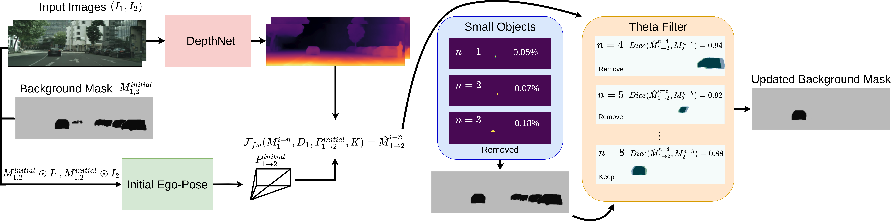

# Dyna-DM: Dynamic Object-aware Self-supervised Monocular Depth Maps


 >**Dyna-DM: Dynamic Object-aware Self-supervised Monocular Depth Maps**
 >
 >[[PDF](https://arxiv.org/pdf/2206.03799.pdf)]


<p align="center">
  
</p>


## Install

Our code is tested with CUDA 11.1, Python 3.7.x (conda environment), and PyTorch 1.4.0/1.7.0.

Create a conda environment with PyTorch library as :

```bash
conda create -n my_env python=3.7.4 pytorch=1.7.0 torchvision torchaudio cudatoolkit=11.1 -c pytorch -c nvidia
conda activate my_env
```

Install prerequisite packages listed in :

```bash
pip3 install -r requirements.txt
```

```bash
pip3 install torch-scatter torch-sparse -f https://pytorch-geometric.com/whl/torch-1.7.0+cu110.html
```


## Datasets

We use the datasets provided by Insta-DM.

## Training

You can train the models on KITTI dataset by running :

```bash
bash scripts/train_kt.sh
```

You can train the models on the Cityscape dataset by running :

```bash
bash scripts/train_cs.sh
```

Location of data... `$TRAIN_SET`.

The hyperparameters are defined in each script file and [default arguments](train.py) in `train.py`. 

## Models

Pretrained models for CityScape and KITTI+CityScape are proveded in a link...
Where Cityscape is just trained on cityscape and KITTI+CityScape is trained on both CityScape and KITTI.


## Evaluation

We evaluate our depth estimation following the [KITTI Eigen split](https://arxiv.org/abs/1406.2283).
For the evaluation, it is required to download the [KITTI raw dataset](http://www.cvlibs.net/download.php?file=raw_data_downloader.zip) provided on the official website.

You can evaluate the models by running :

```bash
bash scripts/run_eigen_test.sh
```

Please indicate the location of the raw dataset with `$DATA_ROOT`, and the models with `$DISP_NET`.

## References
 
* [Insta-DM](https://github.com/SeokjuLee/Insta-DM) (AAAI 2021, our baseline framework)

* [Struct2Depth](https://github.com/tensorflow/models/blob/archive/research/struct2depth) (AAAI 2019, object scale loss)


...more

 
